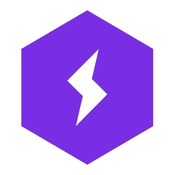

<!-- Greeting -->
<h1 style="border: None; margin: 0; font-weight: 700; "> <i> Hello World, </i>  </h1>

<!--Introduction -->

Welcome to my Github profile. I'm Lezwon Castelino. I am currently working as a Computer Vision Engineer at [Camcom.ai](http://camcom.ai/) :camera:. I am also an ex-core contributor to [PyTorch Lightning](https://www.pytorchlightning.ai/) . Following are some of the interesting projects I've worked.

* ### [**Reinforcement Learning for FIFA**](https://github.com/lezwon/DeepGamingAI_FIFARL) 
     A neural networks learns to play FIFA based on the score.

* ### [**GraphQl-UI**](https://github.com/lezwon/GraphQl-UI)  
    A tool to automatically generate a form generated based on the GraphQL schema. Kin d of like Postman for GraphQL.

* ### [**Category Matching**](https://github.com/lezwon/category-matching) 
    A tool to match similar categories from Set A to categories in Set B. For example Barrister is mapped to Lawyer. The solution based on Google Maps data.

 

#  *Awards & Recognition*
Over the years I have participated in over 20 Hackathons with my team. We have built solutions on a diverse range of platforms. Here are some of my notable wins and achivements.

* ### **Winner at Synup Contest on Category Mapping 2018**
    Built a solution to match and map similar categories between different platforms.
* ### **Winner at UiPath Power of Automation 2018**
    Built an Image-to-HTML solution using UIPath.
* ### **Winner at Microsoft Indiastack on Azure Hackathon 2017**
    Built a telegram bot to provide Aadhar related services.
* ### **Winner at Honeywell Power of Connected Hackathon 2017**
    Built a self-driving NN bot to automatically steer the vehicle in PyTux game.

 

#   *Connect with me*

